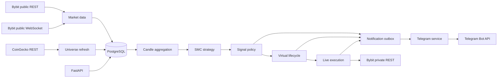

# StructurePulse - Architecture v1.2

## 1. Overview

StructurePulse is a modular Python 3.12 monolith deployed with Docker Compose.
It continuously ingests Bybit market data, builds deterministic SMC analysis,
publishes Telegram signals, tracks every signal virtually, and can optionally
execute live Bybit futures orders.

The system is intentionally split into clear runtime roles:

- `api`: HTTP health, metrics, debug, observation, and read-only status routes.
- `worker`: universe refresh, market data, aggregation, strategy analysis,
  signal lifecycle, live execution, operational monitoring, and maintenance.
- `telegram`: Telegram commands and outbox delivery.
- `postgres`: system of record.

All roles use the same application image and one PostgreSQL database.

## 2. Technology Stack

- Python 3.12.
- FastAPI for HTTP API.
- asyncio for I/O orchestration.
- SQLAlchemy 2 async with asyncpg.
- PostgreSQL 16.
- Alembic migrations.
- Pydantic settings and validation.
- HTTPX for REST adapters.
- websockets for Bybit public streams.
- aiogram for Telegram.
- structlog JSON logs.
- Prometheus metrics.
- pytest, pytest-asyncio, Ruff, and mypy.

External provider response shapes are normalized at adapter boundaries. Domain
logic must not depend directly on Bybit, CoinGecko, or Telegram SDK payloads.

## 3. Runtime Topology



## 4. Module Boundaries

### 4.1 Universe

Selects the active trading universe:

- fetch ranking from CoinGecko;
- filter stablecoins, wrapped assets, tokenized stocks, leveraged tokens, and
  manual denylist entries;
- intersect with active Bybit USDT linear perpetual instruments;
- apply spread, liquidity, age, and data-quality filters;
- keep 30 active symbols for current live testing.

The last valid universe is retained when CoinGecko fails.

### 4.2 Market Data

Maintains public Bybit data:

- sharded kline WebSockets for active universe symbols;
- REST backfill for startup, reconnect, and gap repair;
- readiness per symbol;
- gap detection and durable checkpoints;
- sampled reconciliation against Bybit REST candles.

The canonical market series is the closed 1m candle in UTC.

### 4.3 Candle Aggregation

Aggregates canonical 1m candles into:

- 5m;
- 15m;
- 1H;
- 4H.

Aggregation is deterministic, idempotent, resumable, and batch-limited so
historical rebuilds do not starve live processing.

### 4.4 SMC Core

`smc_core` is a pure synchronous package. It detects:

- swings;
- BOS;
- CHOCH/MSS;
- liquidity sweeps;
- equal highs/lows;
- FVGs;
- displacement;
- Order Blocks;
- dealing ranges;
- premium/discount.

It has no dependency on Bybit, PostgreSQL, FastAPI, asyncio, or Telegram.

### 4.5 Strategy and Signal Policy

The strategy service:

- loads closed multi-timeframe candles;
- runs SMC analysis through a bounded process pool;
- evaluates LONG and SHORT candidates;
- persists accepted and suppressed candidates;
- applies score threshold, cooldown, one-active-signal-per-symbol,
  portfolio/burst limits, and BTC circuit breaker.

Accepted signals are first created as `preparing` so trade coverage can be
established before publication.

### 4.6 Virtual Lifecycle

Virtual lifecycle tracking:

- subscribes to Bybit public trades only for symbols with pending or active
  signals;
- uses a REST overlap to close the WebSocket subscription handshake window;
- resolves entry, stop, TP1, TP2, invalidation, and expiration by exchange
  event order;
- stores signal events and virtual trade state;
- falls back conservatively when exact event order cannot be proven.

Virtual PnL includes estimated taker fees and funding.

### 4.7 Live Execution

Live execution is part of the worker and is disabled by default.

It runs only when:

```dotenv
EXECUTION_ENABLED=true
EXECUTION_MODE=auto
BYBIT_API_KEY=...
BYBIT_API_SECRET=...
```

Execution flow:

1. Virtual lifecycle marks a signal as `entered`.
2. Execution repository claims a live entry if portfolio guards allow it.
3. Worker fetches current Bybit wallet balance.
4. Worker calculates risk-based quantity and may downsize risk to fit margin.
5. Worker checks current bid/ask against slippage and entry-zone guard.
6. Worker sets leverage.
7. Worker submits market entry.
8. Worker reads actual Bybit position size.
9. Worker sets full-position stop.
10. When virtual lifecycle reaches TP1 or terminal state, worker sends
    reduce-only orders as needed.
11. On live close, worker fetches Bybit closed PnL and adds it to the Telegram
    outbox payload.

Execution fails closed. A failed live execution does not stop virtual tracking.

Current live guards:

- max open positions;
- max trades per UTC day;
- max daily live loss;
- available margin;
- adaptive minimum risk;
- configured leverage and max effective leverage;
- current bid/ask slippage;
- exchange min/max quantity and notional constraints;
- reduce-only close handling for already-flat positions.

### 4.8 Telegram

Telegram service:

- allows only configured user IDs;
- handles private commands;
- renders RU/EN messages;
- consumes `notification_outbox`;
- creates per-user delivery records;
- retries transient failures with bounded backoff;
- avoids duplicate logical delivery through idempotency keys.

New signal messages can be schedule-filtered. Lifecycle and service messages
continue outside the new-signal window.

### 4.9 Observation

Observation windows freeze a strategy version and produce reports over
persisted virtual results. Current reports focus on virtual outcomes. Live
execution records are stored, and live-close Telegram messages include Bybit
real PnL, but full live-vs-virtual analytics are still a next step.

## 5. State Machines

### Signal

```text
preparing
  -> active
       -> expired
       -> invalidated
       -> entered

entered
  -> stopped
  -> tp1_reached
  -> ambiguous

tp1_reached
  -> stopped_at_breakeven
  -> tp2_completed
  -> ambiguous
```

### Live execution

```text
none
  -> entry_submitting
       -> open
       -> failed

open
  -> tp1_submitting
  -> closing
  -> failed

tp1_submitting
  -> tp1_reduced
  -> failed

tp1_reduced
  -> closing
  -> failed

closing
  -> closed
  -> failed
```

### Market stream

```text
offline -> connecting -> warming -> ready
                         -> degraded -> recovering -> ready
```

Only ready symbols can generate new signals.

## 6. PostgreSQL Model

Important tables:

- `instruments`;
- `universe_snapshots`;
- `universe_members`;
- `candles_1m`;
- `candles_agg`;
- `market_snapshots`;
- `data_checkpoints`;
- `data_gaps`;
- `strategy_versions`;
- `analysis_snapshots`;
- `signal_candidates`;
- `signals`;
- `signal_events`;
- `virtual_trades`;
- `live_executions`;
- `user_settings`;
- `notification_outbox`;
- `notification_deliveries`;
- `evaluation_windows`.

Prices, quantities, and money use PostgreSQL `NUMERIC`.
Timestamps use UTC `TIMESTAMPTZ`.

## 7. Consistency and Idempotency

- Candles are unique by symbol and open time.
- Signal candidates are deduplicated by symbol, direction, strategy, setup
  anchor, and lifecycle window.
- Signal state transitions are persisted as immutable events.
- Telegram outbox uses unique idempotency keys.
- Live execution has one row per signal.
- Live orders use deterministic `orderLinkId` values.
- Reduce-only close paths handle already-flat Bybit positions.

## 8. Failure Behavior

- CoinGecko failure keeps the previous universe.
- Bybit public-data failure degrades only affected symbols.
- PostgreSQL failure stops signal generation.
- Telegram failure keeps messages in outbox.
- Live execution failure records the error and does not create duplicate
  orders.
- Slippage failure records `live entry skipped` and sends no Bybit order.
- Closed PnL fetch failure does not block closing; it only omits `Real PnL` in
  Telegram and logs the error.

## 9. Deployment

Local Docker Compose services:

```text
postgres
api
worker
telegram
```

Migrations run explicitly:

```powershell
docker compose run --rm migrate
```

Schema changes follow expand-and-contract rules. Stop or quiesce writers before
running migrations that can affect hot tables.

## 10. Security

- Secrets are supplied through `.env` and are not committed.
- Bybit API keys must have withdrawal permissions disabled.
- Telegram bot token is never logged.
- Telegram access is restricted by allowed user IDs.
- Containers run as non-root.
- Live execution is protected by explicit feature flags.

## 11. Deferred Work

- Persistent real-PnL analytics tables.
- Live-vs-virtual observation reports.
- Bybit private WebSocket reconciliation.
- Manual approval execution mode.
- Multi-user authorization.
- Web dashboard.
- Broker-based event bus.
