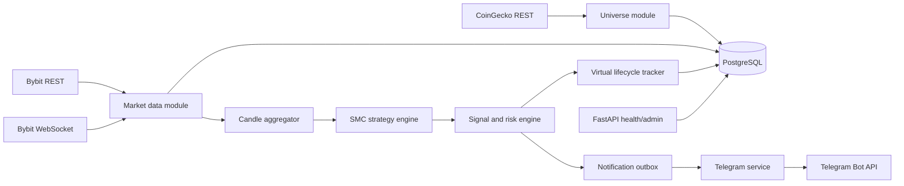

# Crypto SMC Signal Bot - Architecture v1.1

## 1. Architectural approach

The MVP is a modular monolith written in Python 3.12 and deployed with Docker
Compose. It uses one codebase and one PostgreSQL database, but separates
market-data ingestion, strategy analysis, signal lifecycle, and Telegram
delivery into explicit modules.

This approach keeps local deployment and debugging simple while preserving
boundaries that allow high-load components or real order execution to be
extracted later.

## 2. Technology stack

- Runtime: Python 3.12.
- Async I/O: asyncio.
- Numerical calculations: NumPy where vectorization provides a measurable
  benefit.
- HTTP/admin API: FastAPI.
- Validation and settings: Pydantic.
- Database access: SQLAlchemy 2 async with asyncpg.
- Database migrations: Alembic.
- Telegram: aiogram.
- Bybit REST: typed adapter over HTTPX.
- Bybit WebSocket: typed adapter over websockets.
- Scheduling: APScheduler with PostgreSQL-backed application state.
- Logging: structlog JSON logs.
- Metrics: Prometheus client.
- Tests: pytest, pytest-asyncio, and testcontainers where integration coverage
  is required.
- Packaging and tooling: uv, Ruff, and mypy.
- Deployment: Docker Compose with PostgreSQL 16.

Exchange and ranking-provider clients are internal adapters. No strategy or
domain module may depend directly on an external SDK response shape.

## 3. Runtime topology

The same application image supports separate process roles:

- `api`: health, readiness, metrics, and future administration endpoints.
- `worker`: universe refresh, market data, candle aggregation, strategy
  analysis, signal tracking, and recovery.
- `telegram`: commands, localized messages, and notification delivery.
- `postgres`: durable application state.

For local MVP deployment, `worker` is a single replica. Horizontal scaling is
not enabled until ownership and partitioning of WebSocket subscriptions are
implemented.



## 4. Module boundaries

### 4.1 Universe

Responsibilities:

- Refresh the capitalization ranking once per day.
- Apply stablecoin, wrapped-asset, tokenized-stock, leveraged-token, and manual
  denylist filters.
- Intersect ranked assets with active Bybit USDT Linear Perpetual contracts.
- Apply liquidity, spread, age, and data-quality filters.
- Activate the first 30 eligible assets for the MVP. The configured universe
  may later be increased up to the initial supported maximum of 60.
- Preserve the previous valid universe when CoinGecko is unavailable.

Outputs are versioned universe snapshots. A symbol is never removed from
tracking while it has an active signal or virtual trade.

### 4.2 Market data

Responsibilities:

- Maintain sharded Bybit WebSocket connections.
- Ingest Bybit `1m` kline updates for every active universe instrument.
- Ingest ticker data needed for spread, funding, turnover, mark price, and Open
  Interest snapshots.
- Subscribe to ordered public trades for instruments with a pending or active
  signal.
- Backfill and reconcile gaps through REST.
- Track readiness per symbol and data stream.

WebSocket shards are created by configured topic-count and payload-length
limits. One failed shard must not stop healthy shards.

### 4.3 Candle aggregation

The canonical stored market series is the closed `1m` candle in UTC.

The application deterministically aggregates it into:

- 5m;
- 15m;
- 1H;
- 4H.

This avoids four independent live candle subscriptions and guarantees that all
strategy timeframes use the same source series. Aggregates are recalculated
when a repaired 1m candle changes.

Exchange timestamps define candle boundaries. Local machine time must never
define market intervals.

### 4.4 SMC strategy engine

Responsibilities:

- Detect swings, BOS, CHOCH/MSS, sweeps, equal highs/lows, FVGs, Order Blocks,
  displacement, and premium/discount.
- Build immutable analysis snapshots from closed candles.
- Evaluate LONG and SHORT setup rules.
- Return score components and evidence without performing notification or
  persistence side effects.

The engine is a pure domain library wherever practical. Given the same candles
and strategy configuration, it must return the same result.

Strategy calculations must never run directly on the market-data event loop
when they can exceed the configured CPU budget:

- Prefer vectorized NumPy calculations for rolling and array-based work.
- Small bounded calculations may run inline after profiling confirms that they
  do not delay WebSocket heartbeat handling.
- Heavier symbol batches run through a bounded `ProcessPoolExecutor`.
- `asyncio.to_thread` is reserved for blocking library calls that release the
  GIL; it is not the default solution for Python CPU-bound strategy code.
- Analysis jobs are queued with bounded capacity and coalesced by symbol and
  timeframe so stale duplicate recalculations cannot accumulate.
- WebSocket ingestion, persistence, and heartbeat tasks remain responsive while
  analysis jobs execute.

Worker readiness and metrics include event-loop lag, analysis queue depth,
analysis duration by timeframe, and missed processing deadlines.

### 4.5 Signal and risk engine

Responsibilities:

- Validate the minimum score and reward-to-risk.
- Calculate entry, invalidation, Stop Loss, targets, position size, margin,
  leverage warning, and estimated costs.
- Apply per-symbol deduplication, cooldown, global burst limits, and the BTC
  circuit breaker.
- Persist accepted and suppressed candidates.
- Create a transactional notification outbox entry for accepted signals.

The signal and its outbox event are committed in one database transaction.

### 4.6 Virtual lifecycle tracker

Responsibilities:

- Subscribe to public trades before an accepted signal is published.
- Track entry-zone touch, invalidation, Stop Loss, TP1, and TP2 in exchange
  event order.
- Persist the last processed exchange timestamp and event identity.
- Resume from the durable checkpoint after restart.
- Fall back to reconciled 1m candles and conservative ambiguity handling when
  ordered events cannot be recovered.
- Calculate fees, funding estimates, realized R multiples, and final outcome.

To avoid missing an immediate fill, the publication flow is:

1. Persist the accepted signal as `preparing`.
2. Record a `tracking_from` exchange timestamp immediately before requesting
   the public-trade subscription.
3. Start and acknowledge the public-trade subscription, buffering all received
   events.
4. Request recent public trades through Bybit REST covering `tracking_from`
   through the first buffered WebSocket event.
5. Merge REST and buffered WebSocket events by exchange trade identity and
   timestamp, remove duplicates, and replay them in exchange order.
6. Record the durable tracking checkpoint.
7. Change the signal to `active` and create its outbox message.

The REST overlap closes the handshake window between signal calculation and
the first received WebSocket trade. Its time range and page limits must be
large enough to prove continuous coverage. If complete ordered coverage cannot
be established, the signal is suppressed and not published. A latest-price
snapshot alone is not sufficient because it cannot prove event order.

### 4.7 Telegram

Responsibilities:

- Restrict access to configured Telegram user IDs.
- Process commands and settings.
- Render Russian and English messages from structured signal data.
- Deliver outbox messages idempotently.
- Retry temporary Telegram failures with bounded exponential backoff.
- Avoid duplicate delivery through a unique message idempotency key.

### 4.8 Health and operations

Responsibilities:

- Expose `/health/live`, `/health/ready`, and `/metrics`.
- Report stale streams and recovery status per instrument.
- Emit one bounded service warning for sustained upstream failures.
- Provide structured audit events for strategy configuration, recovery,
  suppression, and state transitions.

## 5. Data flow

### 5.1 Startup and recovery

1. Load active universe, open signals, checkpoints, and strategy version.
2. Mark market streams as warming.
3. Connect WebSocket shards and buffer incoming events.
4. Find gaps from durable checkpoints to current exchange time.
5. Backfill missing 1m candles and required snapshots through REST.
6. Merge buffered and REST data by exchange identity and timestamp.
7. Rebuild affected aggregates and analysis state.
8. Reconcile open virtual trades.
9. Mark each healthy symbol ready.
10. Enable new signal generation only for ready symbols.

### 5.2 Closed-candle analysis

1. Bybit confirms a closed 1m candle.
2. The candle is upserted idempotently.
3. Completed higher-timeframe aggregates are generated.
4. A completed 5m, 15m, 1H, or 4H candle triggers relevant analysis.
5. The strategy engine creates an analysis snapshot.
6. The signal engine evaluates, scores, and either accepts or suppresses the
   candidate.
7. An accepted signal starts trade-stream tracking before notification.

### 5.3 Signal completion

1. Ordered trades are matched against the signal price levels.
2. State transitions are committed with their source event identity.
3. TP, stop, invalidation, or expiration produces an outbox update.
4. Statistics are recalculated asynchronously from persisted outcomes.
5. The public-trade subscription is released when no signal needs it.

## 6. Domain state machines

### Signal

```text
candidate
  -> suppressed
  -> preparing
  -> active
       -> expired
       -> invalidated
       -> entered

entered
  -> stopped
  -> tp1_reached
  -> ambiguous

tp1_reached
  -> stopped_at_breakeven
  -> tp2_completed
  -> ambiguous
```

The initial policy closes 50% at TP1, moves the remaining Stop Loss to
fee-adjusted breakeven, and closes the remainder at TP2 or the adjusted stop.
The exact policy is stored with the strategy version.

### Market stream

```text
offline -> connecting -> warming -> ready
                         -> degraded -> recovering -> ready
```

Only `ready` instruments may generate new signals.

## 7. PostgreSQL model

Initial tables:

- `instruments`: Bybit contract identity and exchange constraints.
- `universe_snapshots`: ranked provider result and filter decisions.
- `universe_members`: instruments selected for a snapshot.
- `candles_1m`: canonical closed candles, partitioned by month.
- `candles_agg`: 5m, 15m, 1H, and 4H aggregates.
- `market_snapshots`: ticker, spread, funding, turnover, and Open Interest.
- `data_checkpoints`: durable stream and backfill positions.
- `data_gaps`: detected recovery ranges and outcomes.
- `strategy_versions`: immutable configuration snapshots.
- `analysis_snapshots`: structures and score evidence.
- `signal_candidates`: accepted and suppressed candidates.
- `signals`: published signal levels and lifecycle state.
- `signal_events`: immutable signal state transitions.
- `virtual_trades`: risk, costs, result, and ambiguity flag.
- `user_settings`: schedule, language, risk, and thresholds.
- `notification_outbox`: durable idempotent Telegram delivery.
- `audit_events`: operational and configuration history.

Prices, quantities, and money use PostgreSQL `NUMERIC`, never binary floating
point. Timestamps are stored as `TIMESTAMPTZ` in UTC.

Retention defaults:

- `candles_1m`: 180 days.
- Aggregated candles: retained indefinitely initially.
- Signals, trades, strategy versions, and audit records: retained
  indefinitely.

## 8. Consistency and idempotency

- Candle uniqueness: `(symbol, open_time)`.
- Exchange event uniqueness: exchange-provided identity where available,
  otherwise a documented deterministic composite key.
- Signal uniqueness includes instrument, strategy version, direction, setup
  anchor, and lifecycle window.
- State transitions use optimistic locking or compare-and-set updates.
- Notification delivery uses a unique idempotency key.
- PostgreSQL advisory locks protect scheduled singleton jobs.
- All external calls use finite timeouts and bounded retries.

No message broker is required for the MVP. PostgreSQL outbox and checkpoints
provide durability without introducing Redis or Kafka. A broker can be added
later if worker throughput or distribution requires it.

## 9. Security

- Secrets are loaded from environment variables or Docker secrets.
- Bybit API credentials are not required for public market-data MVP.
- Telegram tokens are never logged.
- Telegram commands require an allowed user ID.
- Containers run as a non-root user.
- Future trading API keys must have withdrawal permissions disabled.
- Real execution must be a separate adapter protected by an explicit feature
  flag and kill switch.

## 10. Failure behavior

- CoinGecko failure: retain the last valid universe and raise a bounded alert.
- Bybit REST failure: continue live processing where data is complete; delay
  recovery-dependent signals.
- Bybit WebSocket failure: reconnect, buffer, backfill, and reconcile before
  returning affected symbols to ready.
- PostgreSQL failure: stop generating signals and reconnect; do not rely on
  memory-only state.
- Telegram failure: keep messages in the outbox and retry without duplicating
  signals.
- Clock drift: use Bybit server timestamps and expose local drift as a health
  warning.

## 11. Testing strategy

- Unit tests for every SMC primitive using fixed candle fixtures.
- Property tests for invariants such as mirrored LONG/SHORT calculations and
  position risk never exceeding configuration.
- State-machine tests for all signal transitions.
- Replay tests using recorded Bybit events.
- Recovery tests with missing, duplicated, and out-of-order data.
- Intrabar tests where entry, Stop Loss, and Take Profit occur close together.
- Integration tests against PostgreSQL in containers.
- Contract tests for normalized Bybit, CoinGecko, and Telegram adapters.
- End-to-end test from a closed candle through an outbox message.

## 12. Deployment layout

```text
docker-compose.yml
  postgres
  api
  worker
  telegram
```

All application roles use the same versioned image. Database migrations run as
an explicit one-shot Compose service or deployment command before application
startup.

Deployment order:

1. Stop signal-producing and market-data writer workers gracefully.
2. Wait for in-flight database transactions and outbox writes to complete.
3. Run the Alembic migration as a one-shot service.
4. Start application roles in warming mode.
5. Complete market-data backfill and reconciliation.
6. Return workers to ready state and resume signal generation.

Production migrations follow an expand-and-contract policy:

- Prefer additive nullable columns, new tables, and concurrent index creation.
- Avoid column renames, type rewrites, table rewrites, and destructive changes
  in the same release that changes application behavior.
- Backfill large datasets in bounded batches outside the schema transaction.
- Deploy code that supports both old and new schemas before removing legacy
  structures in a later release.
- Set explicit PostgreSQL `lock_timeout` and `statement_timeout` values so a
  migration fails visibly instead of blocking ingestion indefinitely.
- Every migration requires a tested forward path, recovery procedure, and
  estimated lock impact.

The local environment exposes only the API health port and PostgreSQL when
development access is explicitly enabled.

## 13. Deferred architecture

The following are intentionally deferred:

- Redis/Kafka event transport.
- Multiple market-data worker replicas.
- Web dashboard.
- Dedicated analytical warehouse.
- Real execution and private Bybit streams.
- Multi-user authorization and billing.

These additions must consume existing domain events and adapters rather than
embedding exchange logic in the strategy engine.

## 14. Key decisions

1. Python is selected because the system is analysis-heavy and will benefit
   from its numerical and testing ecosystem.
2. A modular monolith is selected to minimize operational complexity.
3. Closed 1m candles are canonical; higher timeframes are aggregated locally.
4. WebSocket is primary for live data; REST is used for backfill and repair.
5. Public trades are subscribed only while a signal requires ordered
   intrabar tracking; a REST overlap closes the subscription handshake gap.
6. PostgreSQL is both the system of record and durable outbox for the MVP.
7. Signal generation fails closed when required data is stale or incomplete.
8. CPU-heavy analysis runs outside the market-data event loop.
9. Schema changes use worker quiescence and expand-and-contract migrations.
